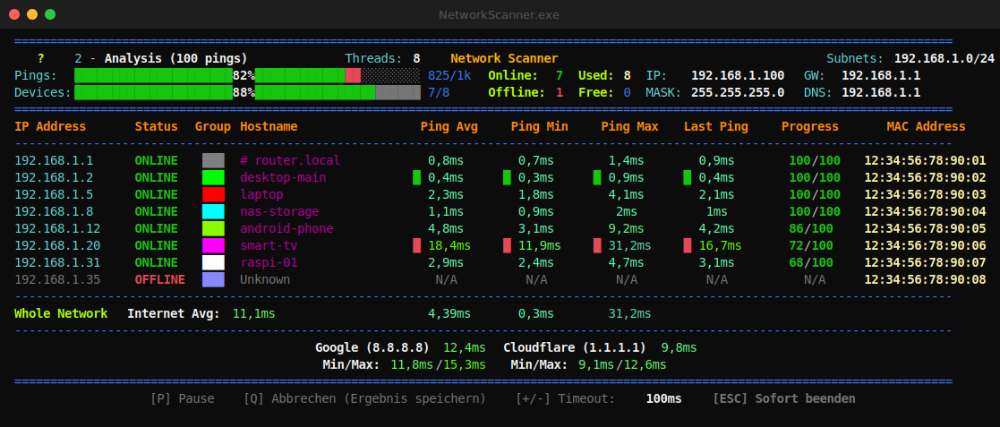

# Network Scanner

A terminal network scanner for Windows. Point it at your LAN and it pings every
host in the subnet, then keeps pinging the ones that answer to measure latency —
min, max, average and the last sample — while drawing a live table that updates
as results come in.



*(Sample data above uses private IPs and made-up MAC addresses — nothing real.)*

## What it does

- Auto-detects your interface, IP, gateway, subnet mask and DNS (no arguments needed).
- Two-stage scan that runs as a pipeline: as soon as a host answers the first
  discovery ping it's handed straight to latency analysis, so the table fills in
  while the rest of the subnet is still being found.
- Resolves hostnames (reverse DNS, with a NetBIOS fallback for cross-subnet hosts)
  and MAC addresses, and labels the vendor from the MAC when there's no hostname.
- Groups related devices by colour (same hostname pattern or MAC prefix).
- Pings a few public resolvers in parallel so you can compare LAN vs. internet latency.
- Remembers the devices it has seen per network in a small local database and lists
  them on later scans even when they're offline.
- Writes a plain-text report after each run, and optionally a CSV.

## Requirements

- Windows 10/11
- Python 3.8+ on your `PATH` (only needed if you run from source — the standalone
  `.exe` has no dependencies)

No admin rights required: latency is measured through the Windows IP Helper API.

## Quick start

Run from source:

```
start.bat
```

That's it — `start.bat` just launches `network_scanner.py`. You can also run
`python network_scanner.py` directly.

When a scan finishes you get a menu to run again with a different ping count, switch
to high-pressure mode, run unlimited, or quit.

## Controls

During a scan (keys work at any time — they're handled on their own thread):

| Key   | Action                                                       |
|-------|--------------------------------------------------------------|
| `P`   | Pause / resume                                               |
| `Q`   | Stop now, keep the results and show the final screen         |
| `ESC` | Abort immediately and quit                                   |

On the menu between runs:

| Key       | Action                                  |
|-----------|-----------------------------------------|
| `1`–`5`   | Re-run with 10 / 100 / 1.000 / 10.000 / 100.000 pings |
| `8`       | Unlimited — keep pinging until you stop |
| `H`       | High-pressure mode (all hosts at once)  |
| `Q`/`ESC` | Quit                                    |

## Configuration

Settings live in `network_scanner.conf`. Copy the template and edit what you need:

```
copy network_scanner.conf.template network_scanner.conf
```

Everything has a sensible default, so an empty config works fine. The options worth
knowing about:

- `ping_count` — pings per device during analysis (default 10).
- `ping_interval_ms` — pause between two pings to the same host (default 100 ms).
  This is what stops a high ping count from racing to 100 % on a fast LAN.
- `subnet` / `subnet_2` … — scan specific subnets instead of (or in addition to)
  the auto-detected one.
- `high_pressure_mode` — ping every host at once with several threads each.
- `output_directory`, `file_output`, `export_csv` — where and what to save.
- `known_devices_db` — turn the known-devices database on or off (on by default).

See `network_scanner.conf.template` for the full list with ranges and defaults.

## Output

After each run the scanner writes `network_scan_YYYYMMDD_HHMMSS.txt` to the output
directory. Set `export_csv = true` to also get a `.csv` with one row per device
(IP, status, hostname, vendor, MAC, latency stats, ping counts) for spreadsheets
or scripts.

## Known-devices database

With `known_devices_db = true` the scanner keeps a small SQLite file
(`known_devices.db`) keyed by the gateway's MAC address. Every device it finds on a
network is saved there. The next time it sees the same router, the devices it knows
about are listed too — even the ones that didn't answer this time — so you can spot
what's missing. The database is updated on every run.

It only ever stores data locally and is git-ignored; nothing leaves your machine.

## Build a standalone .exe

```
build_exe.bat
```

This builds a single standalone `dist\NetworkScanner.exe` with PyInstaller. The
config, the known-devices database and the Scans folder are created next to the
`.exe` at runtime and stay as separate files so you can edit them without
rebuilding.

## Notes

- Built and tested on Windows; the ping/timing path uses Windows APIs. The Linux/
  macOS branches exist but get far less testing.
- Cross-subnet scans work, but hostname/MAC resolution there depends on routing and
  NetBIOS being reachable.
