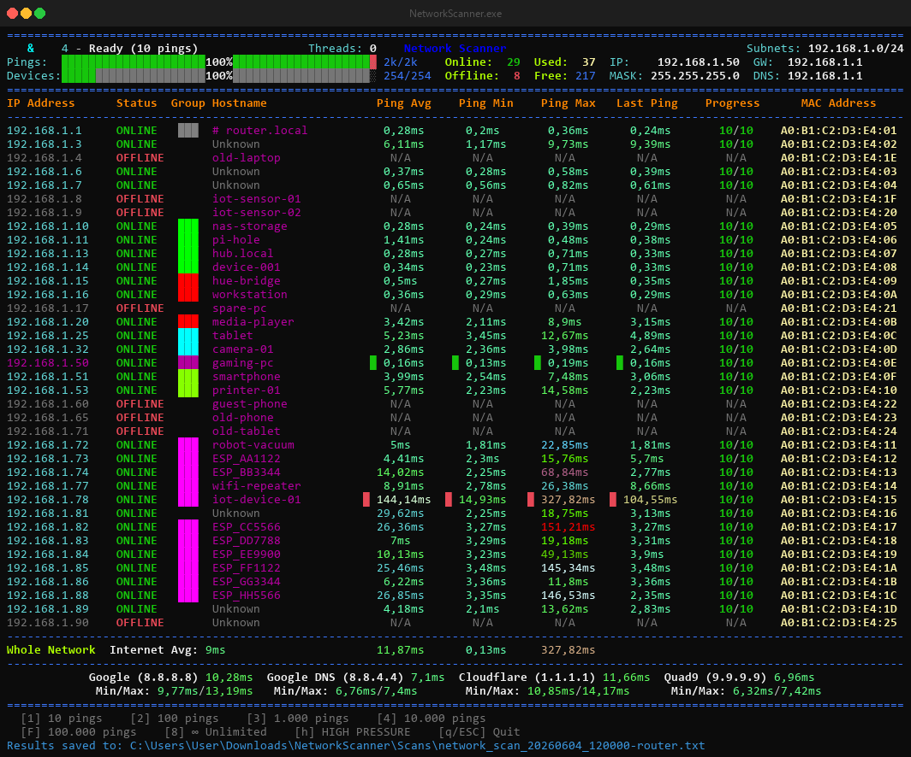

# Network Scanner

A terminal network scanner for Windows. Run it on your LAN and it pings every host in the subnet, then keeps pinging the ones that answer to track latency — min, max, average and the last sample — in a live table.



---

## What it does

- **Auto-detects** your IP, gateway, subnet mask, MAC and DNS without any arguments.
- **Two-stage pipeline** — hosts that reply to the first discovery ping are immediately handed to latency analysis while the rest of the subnet is still being scanned.
- **Resolves hostnames and MACs** via reverse DNS and NetBIOS. Falls back to the vendor name from the MAC prefix when no hostname is available.
- **Device groups** — related hosts share a colour (same hostname pattern or MAC vendor).
- **Internet latency** — pings a few public resolvers alongside local hosts so you can compare both in one view.
- **Known-devices database** — keeps a local SQLite file of every device seen per network. On the next scan, known devices show up immediately, including ones that are currently offline.
- **Pinned IPs** — add any IP to the config to always ping it and keep it at the top of the list, even when it's offline.
- **Saves results** — writes a plain-text report after each run, and optionally a CSV.

---

## Requirements

- Windows 10 / 11
- No admin rights needed — latency runs through the Windows IP Helper API

The standalone `.exe` has no dependencies. To run from source you need Python 3.8+.

---

## Quick start

**Standalone exe** — download `NetworkScanner-v1.5.2.zip` from the [latest release](https://github.com/wbgcoding/Network-Scanner/releases/latest), unzip, run `NetworkScanner.exe`.

Windows may show a SmartScreen warning the first time ("Windows protected your PC"). Click **More info → Run anyway**. The app removes its own download flag on first launch, so the warning won't come back.

**From source:**

```
start.bat
```

or just `python network_scanner.py`.

---

## Controls

During a scan:

| Key   | Action                                   |
|-------|------------------------------------------|
| `P`   | Pause / resume                           |
| `Q`   | Stop, save results, show final screen    |
| `ESC` | Quit immediately                         |
| `+`   | Increase ping interval by 100 ms         |
| `-`   | Decrease ping interval by 100 ms         |

Between runs:

| Key       | Action                                   |
|-----------|------------------------------------------|
| `1`–`5`   | Re-run with 10 / 100 / 1k / 10k / 100k pings |
| `8`       | Unlimited — keep pinging until stopped  |
| `H`       | High-pressure mode (all hosts at once)  |
| `Q`/`ESC` | Quit                                     |

---

## Configuration

Copy the template and edit what you need:

```
copy network_scanner.conf.template network_scanner.conf
```

The scanner runs fine without a config file. Useful options:

| Option | Default | Description |
|--------|---------|-------------|
| `ping_count` | `10` | Pings per device per run |
| `ping_interval_ms` | `100` | Gap between two pings to the same host (ms) |
| `offline_after_failed_pings` | `5` | Mark a device offline after N missed pings in a row |
| `pinned_ips` | *(none)* | Comma-separated IPs to always include at the top |
| `subnet` | auto | Override the detected subnet |
| `export_csv` | `false` | Also write a `.csv` next to the text report |

See `network_scanner.conf.template` for the full list.

---

## Output

Each run writes `network_scan_YYYYMMDD_HHMMSS.txt` to the output directory (next to the exe by default). Set `export_csv = true` for a machine-readable `.csv` with one row per device.

---

## Display

The window auto-fits its width to the table on every update. On screens below 1920×1080 or with Windows DPI scaling above 100 %, the font is reduced automatically to keep the table intact. If it still doesn't fit, add this to your config:

```ini
[display]
console_font_size = 10
```

Valid range 8–18. Set to `0` to disable automatic font and window sizing entirely.

---

## Build the exe

```
build_exe.bat
```

Produces `dist\NetworkScanner.exe` as a single self-contained file. The config, database and `Scans/` folder are created next to it at runtime.

---

## Notes

- Built and tested on Windows. Linux/macOS paths exist but get far less attention.
- Cross-subnet scanning works; hostname and MAC resolution there depends on routing and whether NetBIOS is reachable.
